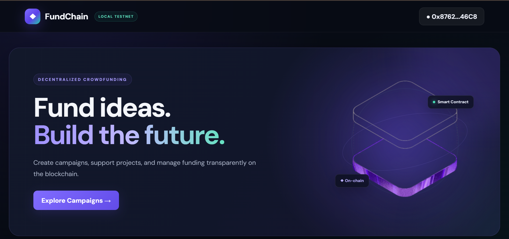

# FundChain

A decentralized crowdfunding DApp built with **Solidity, Foundry, React, TypeScript, ethers.js, and MetaMask**.

FundChain allows users to create crowdfunding campaigns, contribute ETH, withdraw successfully funded campaigns, and claim refunds when campaigns fail to reach their funding goal.

## The project combines a tested Ethereum smart contract with a responsive Web3 frontend and wallet-based blockchain interactions.

## Preview



---

---

## Overview

FundChain demonstrates a complete local Web3 application flow:

- Create crowdfunding campaigns on-chain
- Set funding goals and campaign durations
- Contribute ETH through MetaMask
- Track campaign funding progress
- Detect campaign status automatically
- Withdraw funds after a successful campaign
- Claim refunds when a campaign fails
- Read live blockchain data from the frontend
- Handle wallet and network changes
- Display transaction feedback and errors
- Run automated Solidity tests with Foundry

---

## Tech Stack

### Smart Contract

- Solidity
- Foundry
- Forge
- Anvil
- forge-std

### Frontend

- React
- TypeScript
- Vite
- ethers.js
- CSS

### Web3

- MetaMask
- Ethereum JSON-RPC
- Local Anvil blockchain

---

## Core Features

### Create Campaign

Connected users can create a crowdfunding campaign by defining:

- Funding goal in ETH
- Campaign duration in days

The campaign is created directly through the smart contract.

### Contribute

Users can contribute ETH to active campaigns through MetaMask.

Each contribution is recorded on-chain and associated with the contributor's wallet address.

### Campaign Progress

FundChain displays:

- Amount raised
- Funding goal
- Funding percentage
- Campaign deadline
- Campaign owner
- User contribution
- Current campaign status

### Withdraw Funds

When a campaign:

1. Has ended
2. Has reached its funding goal
3. Has not already been withdrawn

The campaign owner can withdraw the raised ETH.

### Refunds

When a campaign ends without reaching its funding goal, contributors can reclaim their ETH through the smart contract.

---

## Campaign States

The interface distinguishes between four campaign states:

| Status       | Description                                    |
| ------------ | ---------------------------------------------- |
| Active       | Campaign is still accepting contributions      |
| Successful   | Campaign ended and reached its funding goal    |
| Withdrawn    | Campaign owner successfully withdrew the funds |
| Unsuccessful | Campaign ended below its funding goal          |

---

## Smart Contract

The main contract is located at:

```text
src/Crowdfunding.sol
```

Main contract functions:

```solidity
createCampaign()
contribute()
withdraw()
refund()
```

The contract also stores campaign data and individual contributor balances on-chain.

---

## Smart Contract Testing

The Solidity contract is tested using **Foundry**.

Current test suite:

```text
24 tests passed
0 failed
0 skipped
```

The tests cover important success and failure scenarios including:

- Campaign creation
- Invalid campaign goals
- Invalid campaign durations
- Multiple campaigns
- Contributions
- Zero-value contributions
- Contributions after deadline
- Multiple contributors
- Successful withdrawals
- Unauthorized withdrawals
- Withdrawals before deadline
- Withdrawals when goal is not reached
- Double withdrawals
- Successful refunds
- Refunds before deadline
- Refunds after successful campaigns
- Refunds without contributions
- Multiple refunds
- Double refunds
- Failed ETH transfers
- Invalid campaign IDs

Run the tests with:

```bash
forge test
```

---

## Project Structure

```text
crowdfunding-dapp/
├── .github/
├── frontend/
│   ├── src/
│   │   ├── assets/
│   │   │   └── hero.png
│   │   ├── App.tsx
│   │   ├── App.css
│   │   ├── contract.ts
│   │   ├── ethereum.d.ts
│   │   ├── index.css
│   │   └── main.tsx
│   └── package.json
│
├── lib/
│   └── forge-std/
│
├── src/
│   └── Crowdfunding.sol
│
├── test/
├── foundry.toml
├── foundry.lock
└── README.md
```

---

## Local Development

### Prerequisites

Install:

- Git
- Node.js
- npm
- Foundry
- MetaMask

---

### 1. Clone the Repository

```bash
git clone --recurse-submodules https://github.com/yassinweb3/fundchain.git
cd crowdfunding-dapp
```

If the repository was cloned without submodules:

```bash
git submodule update --init --recursive
```

---

### 2. Install Solidity Dependencies

```bash
forge install
```

---

### 3. Build the Smart Contract

```bash
forge build
```

---

### 4. Run the Tests

```bash
forge test
```

---

### 5. Start a Local Blockchain

```bash
anvil
```

The default local RPC endpoint is:

```text
http://127.0.0.1:8545
```

Chain ID:

```text
31337
```

> Anvil accounts and private keys are for local development only. Never use development private keys on a real network.

---

### 6. Deploy the Contract

Deploy `Crowdfunding.sol` to the local Anvil network.

Example:

```bash
forge create src/Crowdfunding.sol:Crowdfunding \
  --rpc-url http://127.0.0.1:8545 \
  --unlocked \
  --from <ANVIL_ACCOUNT_ADDRESS> \
  --broadcast
```

After deployment, update the contract address used by the frontend in:

```text
frontend/src/contract.ts
```

---

### 7. Configure MetaMask

Add the local Anvil network to MetaMask:

```text
Network Name: Anvil Local
RPC URL: http://127.0.0.1:8545
Chain ID: 31337
Currency Symbol: ETH
```

Import one of the development accounts generated by Anvil.

> Use these accounts only for local testing.

---

### 8. Start the Frontend

Open another terminal:

```bash
cd frontend
npm install
npm run dev
```

Then open:

```text
http://localhost:5173
```

Connect MetaMask to **Anvil Local**.

---

## Production Build

To verify the frontend production build:

```bash
cd frontend
npm run build
```

The project has been verified with a successful TypeScript and Vite production build.

---

## Application Flow

```text
Connect MetaMask
       ↓
Create Campaign
       ↓
Campaign Stored On-Chain
       ↓
Users Contribute ETH
       ↓
Campaign Deadline
       ↓
 ┌─────────────────────┐
 │                     │
Goal Reached       Goal Not Reached
 │                     │
 ↓                     ↓
Owner Withdraws    Contributors Refund
```

---

## Security Considerations

The contract includes checks for important crowdfunding conditions such as:

- Invalid campaign IDs
- Zero funding goals
- Invalid campaign durations
- Contributions after campaign expiration
- Unauthorized withdrawals
- Withdrawals before campaign completion
- Withdrawals when the goal has not been reached
- Repeated withdrawals
- Refunds before campaign expiration
- Refunds when the funding goal was reached
- Refunds without an eligible contribution
- Repeated refunds
- ETH transfer failures

This project is currently intended for **development and portfolio demonstration purposes** and has not undergone a professional smart contract security audit.

---

## Current Environment

FundChain currently runs on a local **Anvil development blockchain**.

The architecture can later be extended to a public Ethereum testnet or other EVM-compatible networks.

---

## What I Built

This project was built to practice and demonstrate end-to-end Web3 development, including:

- Writing Solidity smart contracts
- Testing contracts with Foundry
- Running a local Ethereum blockchain with Anvil
- Connecting React to Ethereum using ethers.js
- Integrating MetaMask
- Sending and confirming blockchain transactions
- Reading contract state from a frontend
- Handling wallet and network changes
- Building transaction loading and error states
- Designing a responsive Web3 interface
- Testing complete crowdfunding workflows

---

## Future Improvements

Potential next steps include:

- Public testnet deployment
- Campaign titles and descriptions
- Campaign images
- Campaign categories
- Event-based frontend updates
- Search and filtering
- Pagination
- Enhanced accessibility
- Additional smart contract security review

---

## Author

**Yassin Jamal**

Computer Science graduate and developer focused on Frontend and Web3 development.

---

## Disclaimer

FundChain is an educational and portfolio project.

It currently uses a local development blockchain and test ETH. No real funds are required to run or test the application.
